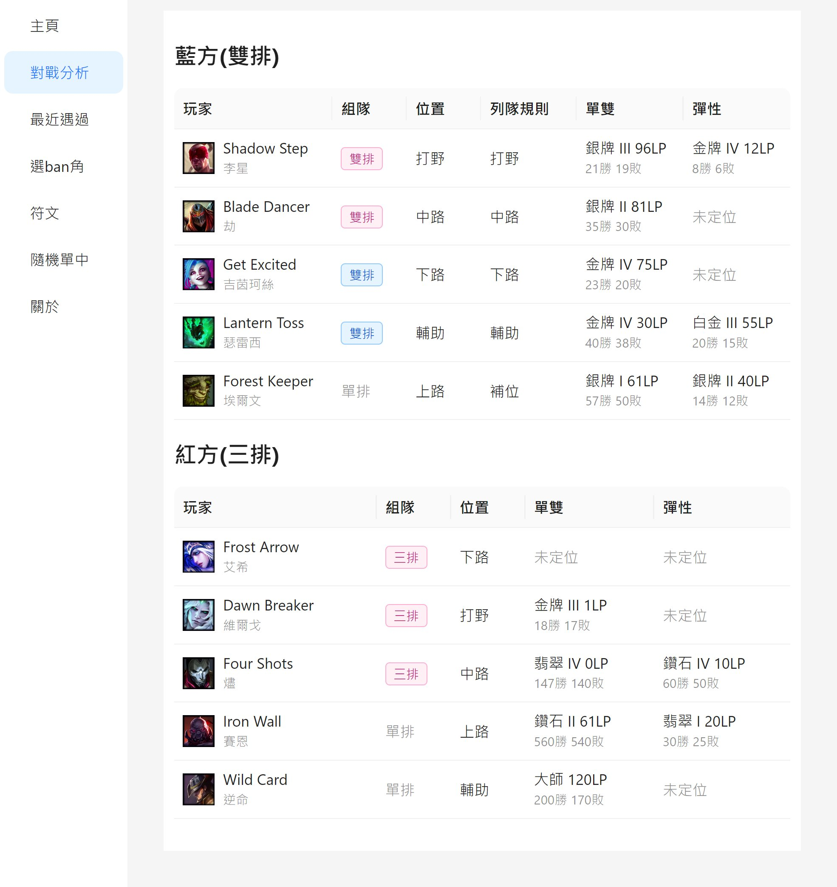

<h1>LOL列隊神器</h1>

  <b>列隊等半天，想上廁所又不敢去？</b> 
  怕一離開就錯過「接受」、怕回來發現自己的本命被 ban、怕選角時間到被踢出去…… 
  別憋了！快來試試 <b>LOL列隊神器</b> ☕

[English](./README_en.md) | 中文

## 功能
- 🚀 **自動接受對戰**：排到了 1 秒內幫你按接受，人不在也不怕被罰
- 🚫 **自動 ban 角**：照你排好的順序自動禁用，第一順位不能 ban 就往下找
- 🎯 **自動預選＋遞補**：開場幫你亮出想玩的英雄，被 ban 被搶就自動換下一隻
- 🔒 **自動鎖角**：剩 1 秒還沒回來？直接幫你鎖，不會因為在洗手就被踢出選角
- 📜 **符文設定檔**：依「路線＋英雄＋對位」自動套用符文，回到座位直接開打
- 🏆 **情報一手掌握**：「對戰分析」一頁看完雙方的組隊、位置與單雙 / 彈性積分，選角時就知道隊友底細
- 🎲 **ARAM 自動搶角**：先勾好想要的英雄，隊友一骰出來就幫你換過來
- 🔄 **一鍵更新**：有新版本自動提醒，按一下就更新好

> 本專案修改自 [jasonwu1994/lol-auto-accept](https://github.com/jasonwu1994/lol-auto-accept)，感謝原作者 **jasonwu1994** 的開源分享。

## 🌟 說明
- **超低CPU使用率**：使用訂閱事件的方式，只有特定事件發生時，程式才會運作，其他時候CPU使用率幾乎為0
- **不干預遊戲內檔案**：不會對遊戲檔案進行注入或修改，保持遊戲純淨
- **安全調用API**：使用與LeagueClient相同的API，安全性高

## 📖 使用說明

### 1. 下載與啟動
1. 到 [Releases](https://github.com/wudishidove/lol_auto_ban_pick/releases) 下載最新版的 `lol-app-win32-x64-<版本>.zip`
2. 解壓縮到任意資料夾(不需要安裝)
3. 開啟 LOL 用戶端並登入，再執行資料夾裡的 `lol-app.exe`
4. 主頁左上角會顯示目前狀態(例如「遊戲大廳」、「列隊等待中」)，看到狀態有在變就代表已經連上用戶端

右上角可以切換中文 / English，以及淺色 / 深色主題。

  
  

### 2. 自動接受對戰
1. 在「主頁」打開 **自動接受對戰**
2. 正常開始列隊，排到對戰時程式會自動幫你按接受
3. 想手動處理時，也可以用上方的 **接受對戰** / **拒絕對戰** 按鈕(按「拒絕對戰」會同時關掉自動接受，避免下一場又被自動接受)
4. 用戶端卡住時，可以按 **強制關閉LOL** 一次關掉所有 LOL 相關程序

### 3. 自動禁用英雄(Ban)
1. 在「主頁」打開 **自動禁用英雄**
2. 到「選ban角」分頁的 **禁用 (Ban)** 頁籤，選擇排序方式：
   - **全局排序**：不分路線，一律用同一份清單
   - **路線排序優先**：依你被分配到的路線(上路 / 打野 / 中路 / 下路 / 輔助)使用對應清單；該路線沒設定、或沒有分路的模式(自訂、盲選)時改用全局清單
3. 依序加入想禁用的英雄，**選取的順序就是優先順序**；第一順位已被禁用或無法禁用時，會自動往下一順位找
4. 細部選項：
   - **無視隊友預選角**：勾選後就算隊友預選了該英雄也照樣禁用；不勾則跳過，改禁下一順位
   - **只選取，不送出確認**：只幫你選好要禁用的英雄，你可以自己改選或按下禁用；時間到時遊戲會自動送出目前選取的英雄
5. 選角期間分頁上方會顯示「目前路線」，清單旁也會標出這場「使用中」的是哪一份

### 4. 自動預選與鎖角(Pick)
1. 在「主頁」打開 **自動預選英雄**
2. 到「選ban角」分頁的 **預選 (Pick)** 頁籤，和禁用一樣選擇「全局排序」或「路線排序優先」，再依序加入想玩的英雄
3. 選角一開場，程式會自動亮出清單中第一隻可用的英雄(已被選走、隊友預選的英雄會跳過)；禁用階段開始後就不再預選
4. 細部選項：
   - **隨機候選**：每場從清單(預選池)隨機挑一隻，而不是依順位
   - **預選被禁用時，自動改選下一順位**：預選的英雄被禁用或被別人選走時，自動改亮清單中下一隻可用的；如果你已經自己改選別隻，就不會覆蓋
   - **自動鎖角**：該場自動預選成功時，輪到你選角且時間剩 1 秒會自動按下鎖定(鎖定當下亮著的英雄，中途自己改選也算)；若預選的英雄已被禁用，改鎖清單中下一隻可用的

### 5. 符文設定檔
符文設定檔以「**路線 + 英雄 + 對位**」為一組，「對位」也可以設成 **通用 (不分對位)**。

**建立設定檔(三種方式擇一)**
- **自動記錄**：打開「符文」分頁的 **自動記錄每場符文**，每場進遊戲時記下你用的符文，賽後補上實際對位並存檔。同一組合以最新一場為準，只記錄有分路的模式
- **從近期對戰挑選**：到 **近期對戰** 頁籤，按該場的星號就能存成設定檔。對戰紀錄不含屬性碎片，存檔前請在右下方選好三個碎片
- **手動新增**：按 **新增設定檔**，選擇英雄、主系 / 副系與屬性碎片(共 9 個)；也可以按 **匯入用戶端目前的符文頁** 直接帶入

**自動套用**
1. 打開 **選角時自動套用**
2. 鎖定英雄後，程式會依敵方亮出的英雄推測對位，套用符合的設定檔；沒有該對位時改用「通用」
3. 選角中若對位猜錯，可以在「符文」分頁的「符文設定檔」頁籤直接點正確的設定檔改套用，這場就不會再自動變更
4. 套用的是不佔頁位的暫時符文頁(名稱以 `AutoRune` 開頭)，不會動到你自己的符文頁

**其他**
- 按設定檔旁的鎖頭圖示可以 **鎖定**，鎖定後不會被自動記錄覆蓋
- 按設定檔的套用按鈕，可以隨時手動套用到用戶端

### 6. 選角時查看隊友資訊
- **顯示隊友積分**：在「主頁」打開 **選角時，顯示隊友積分**，並選擇要看「單雙」、「彈性」或「單雙/彈性」。進入選角後，隊友的牌位會顯示在選角聊天室

  

- **顯示最近遇過**：在「主頁」打開 **選角時，顯示最近遇過**，用滑桿設定要檢查最近幾場對戰。選角時若有隊友最近和你同場過，會把那幾場的戰績顯示在選角聊天室
- **修改名片**：在「主頁」打開 **修改名片**，選擇要顯示的列隊類型與牌位，好友看到的名片牌位就會改成你選的

### 7. 各分頁資訊
進入選角或遊戲後，以下分頁會自動帶出雙方資料：
- **對戰分析**：雙方每位玩家整理在同一張表，依組隊關係分組(一眼看出誰是單排、雙排、三排……)，並列出位置、列隊時選的路線，以及單雙 / 彈性牌位、分數與勝敗
- **最近遇過**：場上玩家中，最近和你同場過的對戰紀錄與戰績

### 8. 隨機單中(ARAM)
**選角 頁籤：自動搶角**
1. 進入 ARAM 選角後，打開「隨機單中」分頁，表格會列出隊友目前的英雄
2. 勾選你想要的英雄(自己的和不能選的英雄無法勾選)
3. 只要勾選的英雄被隊友骰掉、出現在待選區，程式就會立刻幫你換過來
4. 按 **清空** 取消所有勾選；打開 **保持最上層** 可以讓視窗固定在最上面，方便邊看用戶端邊勾

**平衡調整 頁籤**：查看各英雄在 ARAM 的傷害、承受傷害、治療、護盾、韌性等平衡數值

### 9. 更新
- 預設啟動時會自動檢查更新，有新版本時會跳出提示，按 **立即更新** 就會自動下載並重新啟動
- 也可以到「關於」分頁手動 **檢查更新**，或關閉 **啟動時自動檢查更新**

## 🔍 FAQ
### 1. 使用後會不會被封鎖帳號？
- 多位用戶使用超過三年，無任何帳號被鎖   
  本人不負任何責任，請自行評估使用風險  
  如有疑慮，請勿使用

### 2. 為什麼功能失效了？
- 功能完全依賴LeagueClient API，如果官方API更新，可能導致部分功能失效

### 3. 如何刪除程式？
- 把資料夾刪除即可，本程式不會在電腦其他地方生成檔案

### 4. 設定檔在哪裡？
- 一般情況不需要動到設定檔
- lol-app-win32-x64\resources\app\app-config.json

## 🎉 結尾
  **如果這個程式對您有幫助，請給個⭐️！**  
  **這是對我最大的鼓勵！**  
  也請不要忘了給[原作者的專案](https://github.com/jasonwu1994/lol-auto-accept)一個⭐️

## ⚖️ 免責聲明
本程式是非官方的第三方工具，僅透過本機的 League Client (LCU) API 與你自己的遊戲客戶端溝通，不會注入或修改任何遊戲檔案。使用風險請自行評估。

> LOL列隊神器 isn't endorsed by Riot Games and doesn't reflect the views or opinions of Riot Games or anyone officially involved in producing or managing Riot Games properties. Riot Games, and all associated properties are trademarks or registered trademarks of Riot Games, Inc.

隱私權說明請見 [PRIVACY.md](./PRIVACY.md)。
