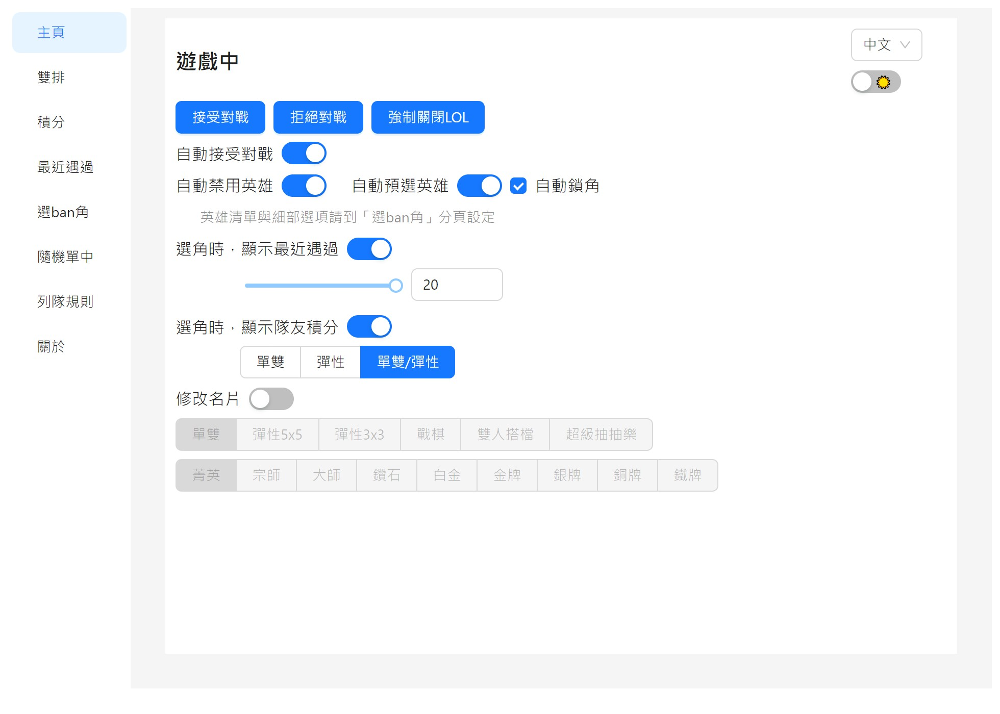
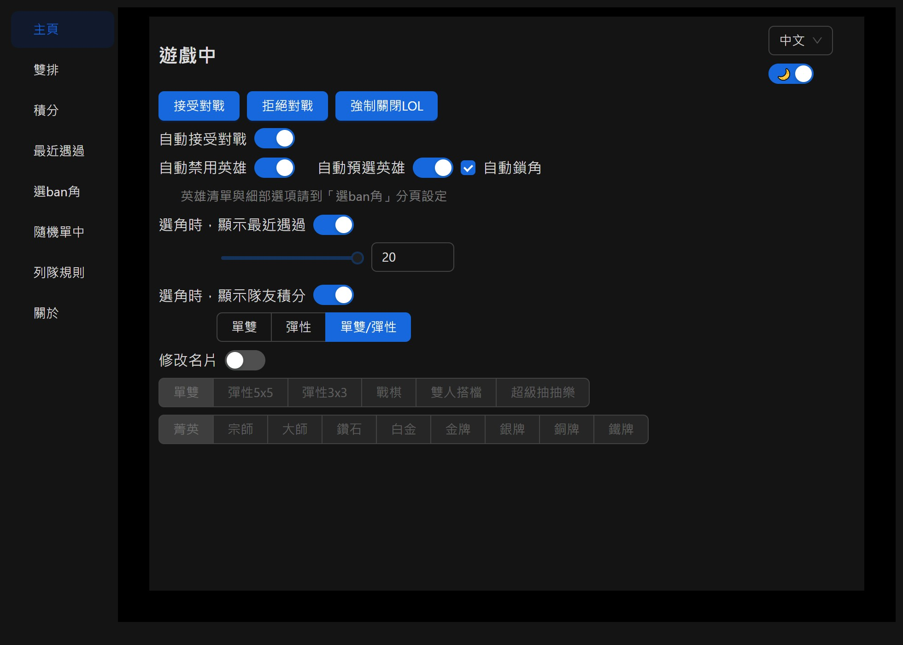
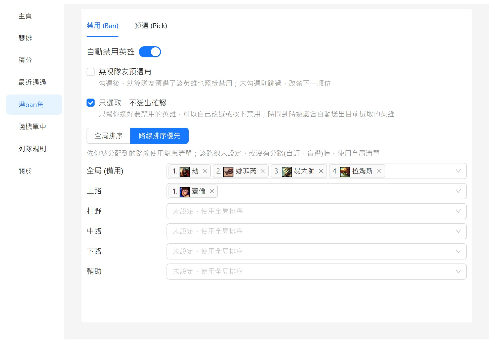
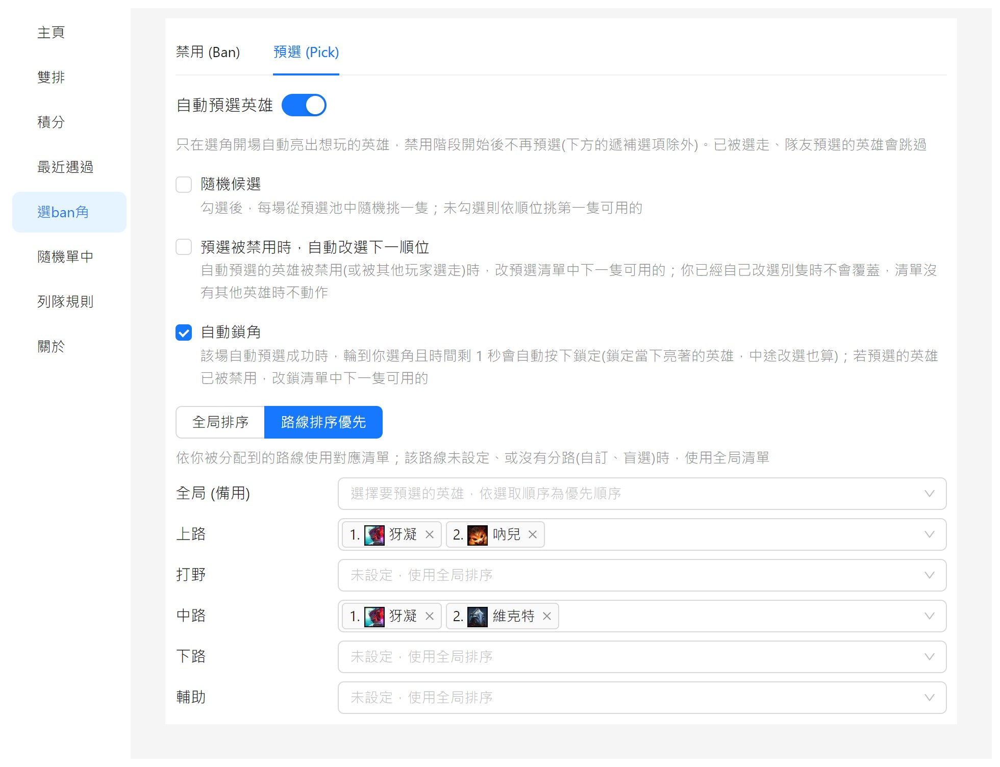
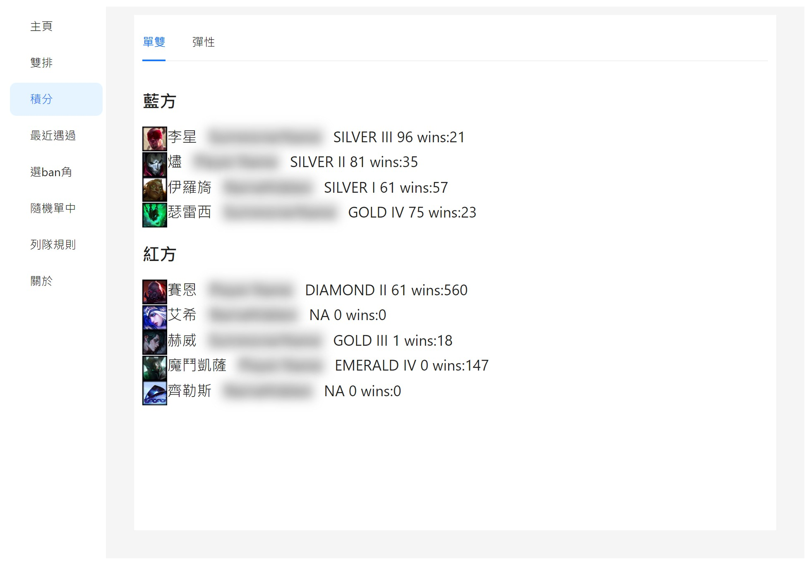
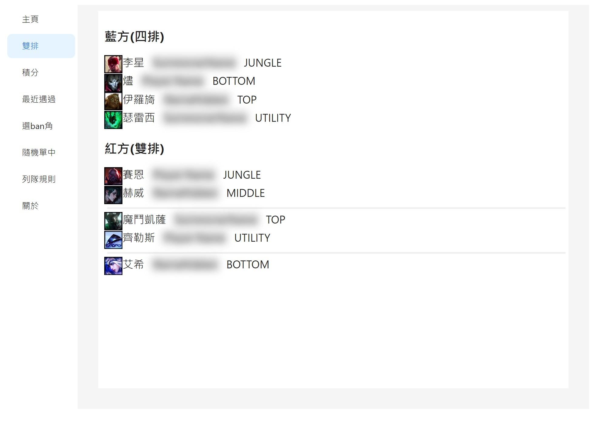
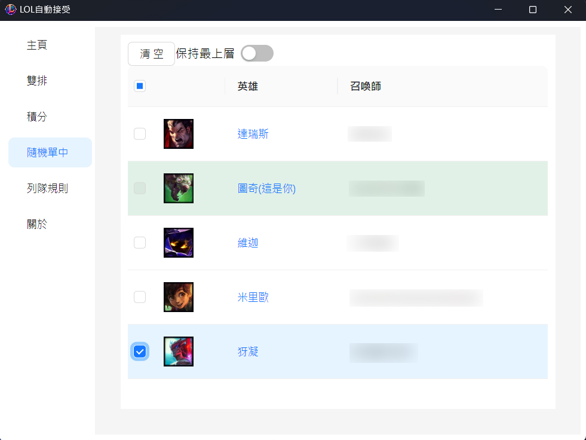
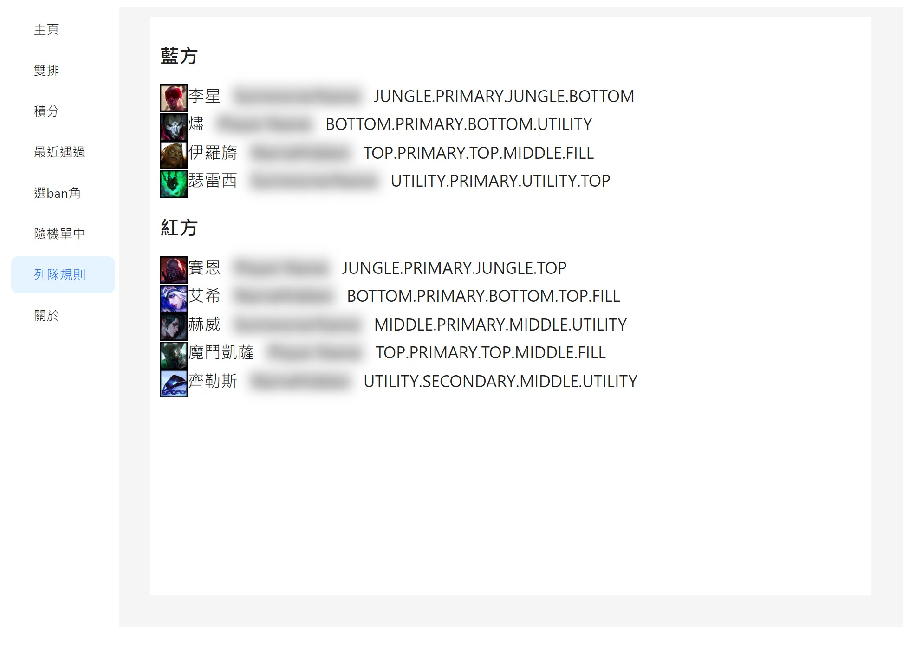
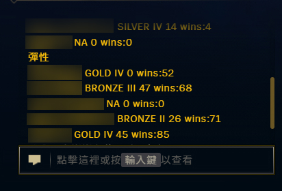

<h1>LOL列隊神器</h1>

  <b>列隊等半天，想上廁所又不敢去？</b> 
  怕一離開就錯過「接受」、怕回來發現自己的本命被 ban、怕選角時間到被踢出去…… 
  別憋了！快來試試 <b>LOL列隊神器</b> 🚽

[English](./README_en.md) | 中文

## 🚽 你負責上廁所，剩下交給它
- 🚀 **自動接受對戰**：排到了 1 秒內幫你按接受，人不在也不怕被罰
- 🚫 **自動 ban 角**：照你排好的順序自動禁用，第一順位不能 ban 就往下找
- 🎯 **自動預選＋遞補**：開場幫你亮出想玩的英雄，被 ban 被搶就自動換下一隻
- 🔒 **自動鎖角**：剩 1 秒還沒回來？直接幫你鎖，不會因為在洗手就被踢出選角
- 📜 **符文設定檔**：依「路線＋英雄＋對位」自動套用符文，回到座位直接開打
- 🏆 **情報一手掌握**：隊友積分、雙排偵測、列隊規則，選角時就知道隊友底細
- 🎲 **ARAM 自動搶角**：先勾好想要的英雄，隊友一骰出來就幫你換過來
- 🔄 **一鍵更新**：有新版本自動提醒，按一下就更新好

> 本專案修改自 [jasonwu1994/lol-auto-accept](https://github.com/jasonwu1994/lol-auto-accept)，感謝原作者 **jasonwu1994** 的開源分享。

## 🌟 說明
- **超低CPU使用率**：使用訂閱事件的方式，只有特定事件發生時，程式才會運作，其他時候CPU使用率幾乎為0
- **不干預遊戲內檔案**：不會對遊戲檔案進行注入或修改，保持遊戲純淨
- **安全調用API**：使用與LeagueClient相同的API，安全性高

## 🖥 截圖

  
  

  
  

  
  

  
  

  

## 🔍 FAQ
### 1. 使用後會不會被封鎖帳號？
- 多位用戶使用超過三年，無任何帳號被鎖   
  本人不負任何責任，請自行評估使用風險  
  如有疑慮，請勿使用

### 2. 為什麼功能失效了？
- 功能完全依賴LeagueClient API，如果官方API更新，可能導致部分功能失效

### 3. 如何刪除程式？
- 把資料夾刪除即可，本程式不會在電腦其他地方生成檔案

### 4. 設定檔在哪裡？
- 一般情況不需要動到設定檔
- lol-app-win32-x64\resources\app\app-config.json

## 🎉 結尾
  **如果這個程式對您有幫助，請給個⭐️！**  
  **這是對我最大的鼓勵！**  
  也請不要忘了給[原作者的專案](https://github.com/jasonwu1994/lol-auto-accept)一個⭐️

## ⚖️ 免責聲明
本程式是非官方的第三方工具，僅透過本機的 League Client (LCU) API 與你自己的遊戲客戶端溝通，不會注入或修改任何遊戲檔案。使用風險請自行評估。

> LOL列隊神器 isn't endorsed by Riot Games and doesn't reflect the views or opinions of Riot Games or anyone officially involved in producing or managing Riot Games properties. Riot Games, and all associated properties are trademarks or registered trademarks of Riot Games, Inc.

隱私權說明請見 [PRIVACY.md](./PRIVACY.md)。
