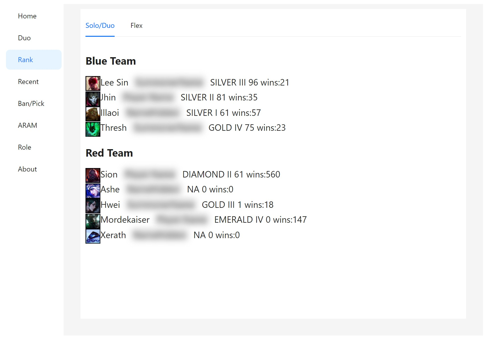
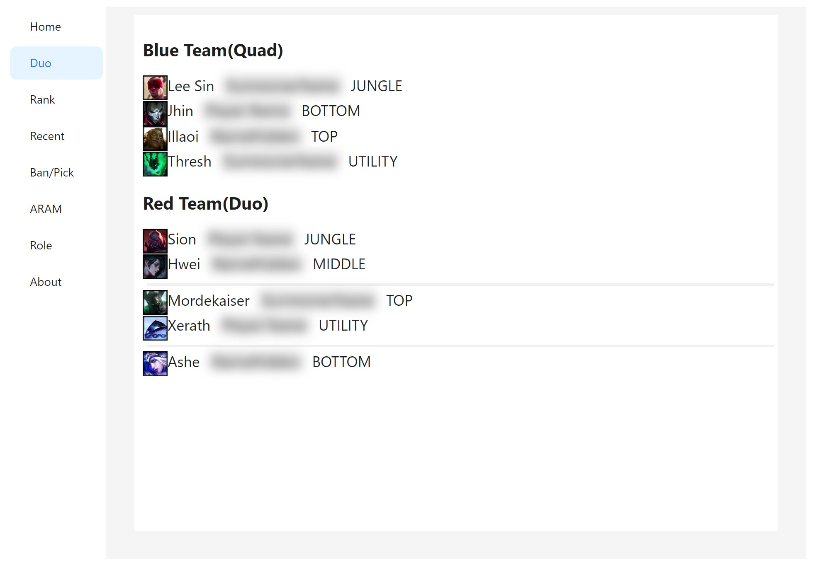
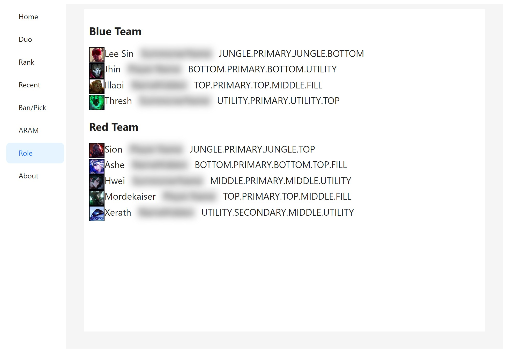

<h1>LoL Auto Ban Pick</h1>

  <b>Stuck in queue forever and too scared to go to the bathroom?</b> 
  Afraid you'll miss the "Accept" button, come back to find your main banned, or get kicked from champ select... 
  Hold it no more! Say hello to <b>LoL Auto Ban Pick</b> 🚽

English | [中文](./README.md)

## 🚽 You handle the bathroom break, it handles the rest
- 🚀 **Auto accept**: accepts the match within 1 second, even when you're away from your desk
- 🚫 **Auto ban**: bans by your priority list, moving down the list if the first one can't be banned
- 🎯 **Auto hover + fallback**: hovers the champion you want, and switches to the next one if it gets banned or picked
- 🔒 **Auto lock in**: still not back with 1 second left? It locks in for you, so you don't get dodged while washing your hands
- 📜 **Rune profiles**: applies runes automatically by lane + champion + matchup, so you're ready the moment you sit down
- 🏆 **Scouting report**: teammate ranks, duo detection and selected roles, right in champ select
- 🎲 **ARAM auto grab**: pre-select the champions you want and grab them as soon as a teammate rolls one
- 🔄 **One-click update**: get notified about new versions and update with a single click

In short: **go to the bathroom, grab a drink, make some instant noodles, all while you queue, stress-free.** 💧

> This project is a modified version of [jasonwu1994/lol-auto-accept](https://github.com/jasonwu1994/lol-auto-accept). Many thanks to the original author **jasonwu1994** for open-sourcing it.

## ✨ Features
1. **🚀 Auto-Accept Matches**: Automatically accepts matches within 1 second.  
   If a match is accepted and you change your mind, you can reject it from the application interface by clicking "Decline Match".
2. **🏆 Display Teammate Scores During Champion Selection**: This feature is inactive if the server no longer displays player names.
3. **👥 Display Duo Players**: In-game, shows duo (or multi) players on both sides, sorted by the number of players.
4. **📖 Display Selected Role**: In-game, shows the Selected Role for players on both sides.
5. **🎲 ARAM**: During ARAM champion selection, you can pre-select your teammates' champions. If one of these champions is rolled, the program will automatically select it for you.
6. **🪪 Modify Hovercard**: Hover over your avatar to see the effect.
7. **🚫 Auto Ban Champion**: When it is your turn to ban, automatically bans a champion following your priority list. Supports a global list or independent per-lane lists (falls back to the global list when the lane is not set). You can choose whether to skip champions hovered by teammates, or to only select the champion without locking it in.
8. **🎯 Auto Hover Champion**: Hovers the champion you want to play at the start of champion select, with the same global / per-lane lists. Optionally picks a random champion from your pool each game, and optionally hovers the next one in the list when the hovered champion gets banned (or picked).
9. **🔒 Auto Lock In**: When the auto hover succeeded this game, locks in whatever is hovered (including your own change) with 1 second left on your pick turn.
10. **📜 Rune Profiles**: Records your runes when a game starts and saves them as a profile with the matchup filled in after the game; profiles can also be imported from match history.  
    After you lock in a champion, the matching profile for your lane + champion + matchup is applied automatically.
11. **🔄 Auto Update**: Checks for a new version at startup (and every 3 hours after that), and lets you download and install it from inside the app with one click.

The home page has quick toggles for Auto Ban / Auto Hover / Auto Lock In; champion lists and detailed options live in the "Ban/Pick" page, and champions can always be searched by English name (e.g. `zed`, `lee sin`). Settings are saved instantly.

## 🌟 Description
- **Ultra-Low CPU Usage**: Operates using event subscriptions, so the program only activates during specific events, resulting in near-zero CPU usage otherwise.
- **Non-Intrusive to Game Files**: Does not inject or alter game files, maintaining the game's integrity.
- **Safe API Usage**: Uses the same API as the LeagueClient, ensuring high security.

## 🖥 Screenshots

  
  

  
  

  
  

  
  

  

## 🔍 FAQ
### 1. Will using this result in a banned account?
- Numerous users have employed this tool for over three years without any account bans.  
  I assume no responsibility; please assess the risks yourself.  
  If in doubt, refrain from using it.

### 2. Why did a feature stop working?
- All functionalities are entirely dependent on the LeagueClient API. If the official API is updated, some features may become inactive.

### 3. How do I uninstall the program?
- Simply delete the folder. This program does not create files elsewhere on your computer.

### 4. Where is the configuration file?
- Under normal circumstances, there is no need to access the configuration file.
- lol-app-win32-x64\resources\app\app-config.json

## 🎉 Conclusion
**If you find this program helpful, please give it a ⭐️！**  
**Your support is the greatest encouragement for me！**  
**Please also give a ⭐️ to the [original project](https://github.com/jasonwu1994/lol-auto-accept).**

## ⚖️ Disclaimer
This is an unofficial third-party tool. It talks only to your own game client through the local League Client (LCU) API and never injects into or modifies any game file. Use it at your own risk.

> LoL Auto Ban Pick isn't endorsed by Riot Games and doesn't reflect the views or opinions of Riot Games or anyone officially involved in producing or managing Riot Games properties. Riot Games, and all associated properties are trademarks or registered trademarks of Riot Games, Inc.

See [PRIVACY.md](./PRIVACY.md) for the privacy notice.
