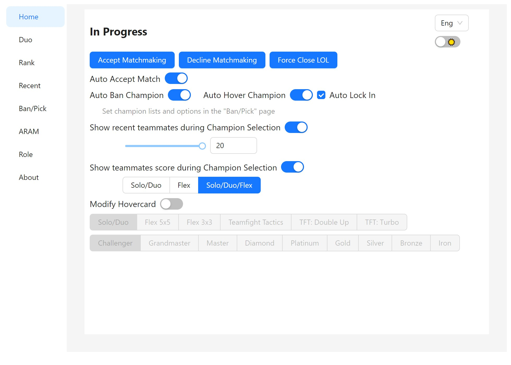
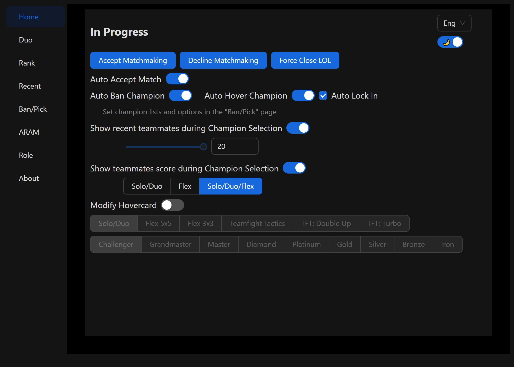
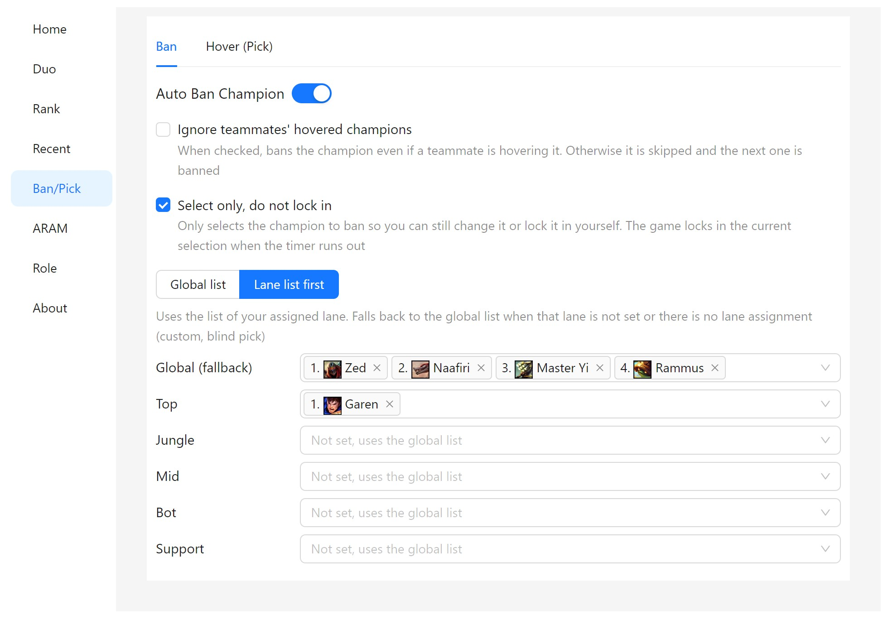
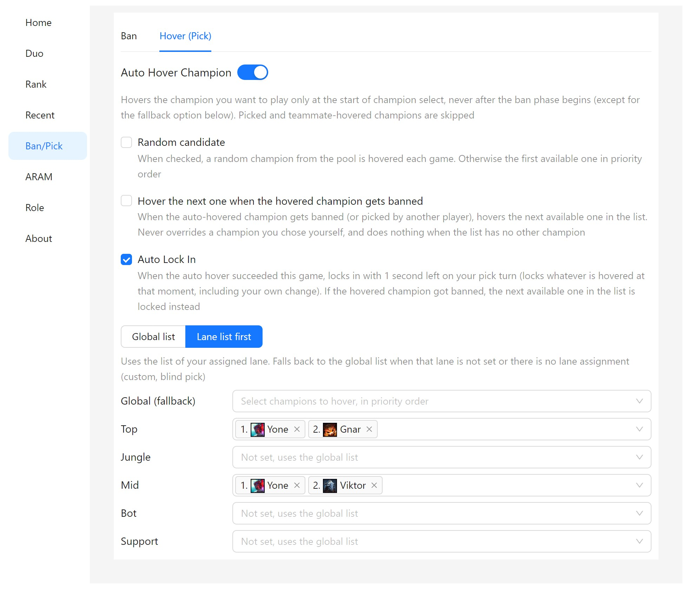
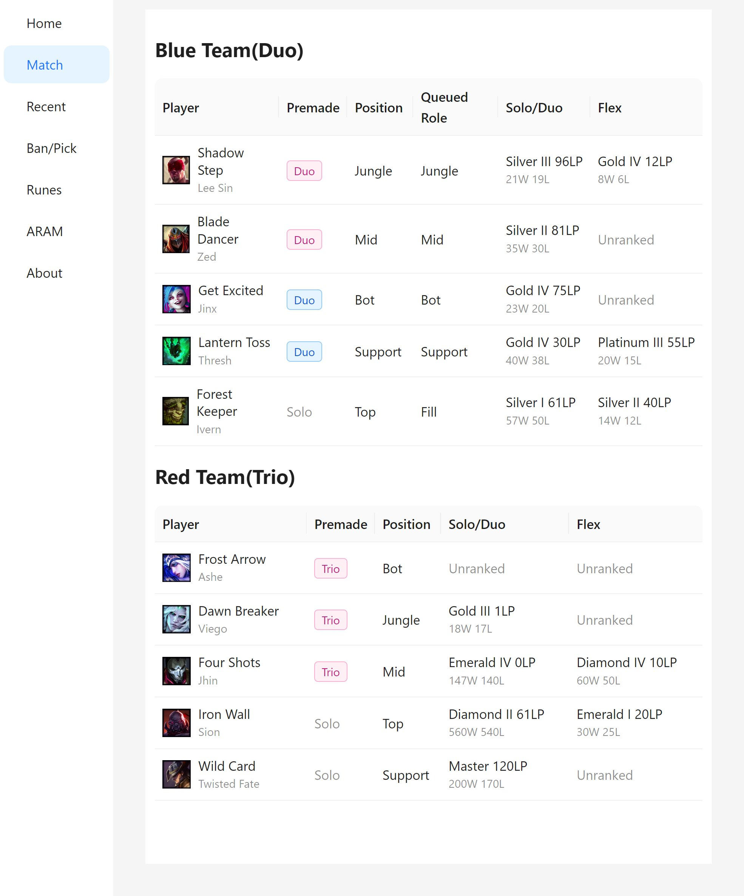
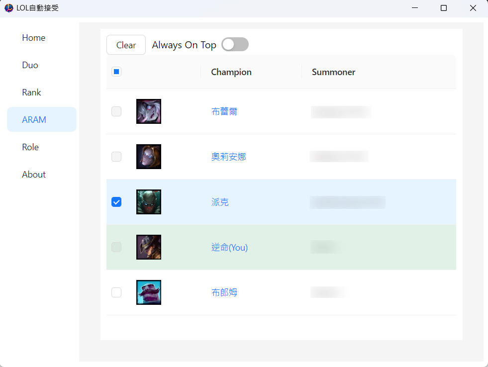
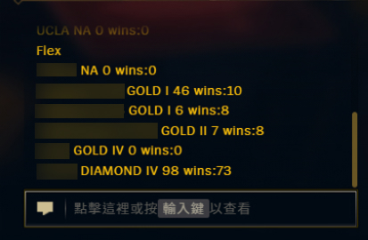

<h1>LoL Auto Ban Pick</h1>

  <b>Stuck in queue forever and too scared to go to the bathroom?</b> 
  Afraid you'll miss the "Accept" button, come back to find your main banned, or get kicked from champ select... 
  Hold it no more! Say hello to <b>LoL Auto Ban Pick</b> 🚽

English | [中文](./README.md)

## 🚽 You handle the bathroom break, it handles the rest
- 🚀 **Auto accept**: accepts the match within 1 second, even when you're away from your desk
- 🚫 **Auto ban**: bans by your priority list, moving down the list if the first one can't be banned
- 🎯 **Auto hover + fallback**: hovers the champion you want, and switches to the next one if it gets banned or picked
- 🔒 **Auto lock in**: still not back with 1 second left? It locks in for you, so you don't get dodged while washing your hands
- 📜 **Rune profiles**: applies runes automatically by lane + champion + matchup, so you're ready the moment you sit down
- 🏆 **Scouting report**: one Match page shows premades, positions and Solo/Duo + Flex ranks for both teams, right in champ select
- 🎲 **ARAM auto grab**: pre-select the champions you want and grab them as soon as a teammate rolls one
- 🔄 **One-click update**: get notified about new versions and update with a single click

> This project is a modified version of [jasonwu1994/lol-auto-accept](https://github.com/jasonwu1994/lol-auto-accept). Many thanks to the original author **jasonwu1994** for open-sourcing it.

## 🌟 Description
- **Ultra-Low CPU Usage**: Operates using event subscriptions, so the program only activates during specific events, resulting in near-zero CPU usage otherwise.
- **Non-Intrusive to Game Files**: Does not inject or alter game files, maintaining the game's integrity.
- **Safe API Usage**: Uses the same API as the LeagueClient, ensuring high security.

## 🖥 Screenshots

  
  

  
  

  
  

  

## 🔍 FAQ
### 1. Will using this result in a banned account?
- Numerous users have employed this tool for over three years without any account bans.  
  I assume no responsibility; please assess the risks yourself.  
  If in doubt, refrain from using it.

### 2. Why did a feature stop working?
- All functionalities are entirely dependent on the LeagueClient API. If the official API is updated, some features may become inactive.

### 3. How do I uninstall the program?
- Simply delete the folder. This program does not create files elsewhere on your computer.

### 4. Where is the configuration file?
- Under normal circumstances, there is no need to access the configuration file.
- lol-app-win32-x64\resources\app\app-config.json

## 🎉 Conclusion
**If you find this program helpful, please give it a ⭐️！**  
**Your support is the greatest encouragement for me！**  
**Please also give a ⭐️ to the [original project](https://github.com/jasonwu1994/lol-auto-accept).**

## ⚖️ Disclaimer
This is an unofficial third-party tool. It talks only to your own game client through the local League Client (LCU) API and never injects into or modifies any game file. Use it at your own risk.

> LoL Auto Ban Pick isn't endorsed by Riot Games and doesn't reflect the views or opinions of Riot Games or anyone officially involved in producing or managing Riot Games properties. Riot Games, and all associated properties are trademarks or registered trademarks of Riot Games, Inc.

See [PRIVACY.md](./PRIVACY.md) for the privacy notice.
